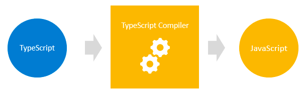
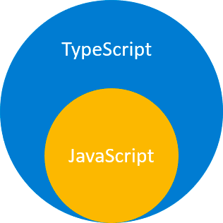
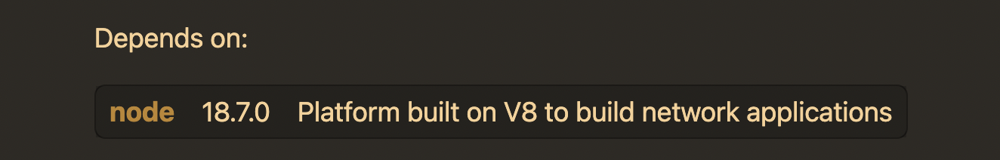
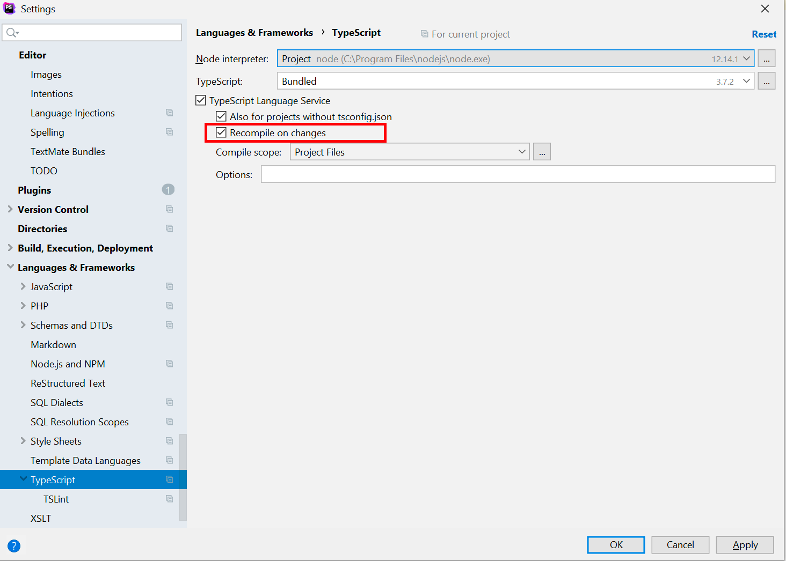
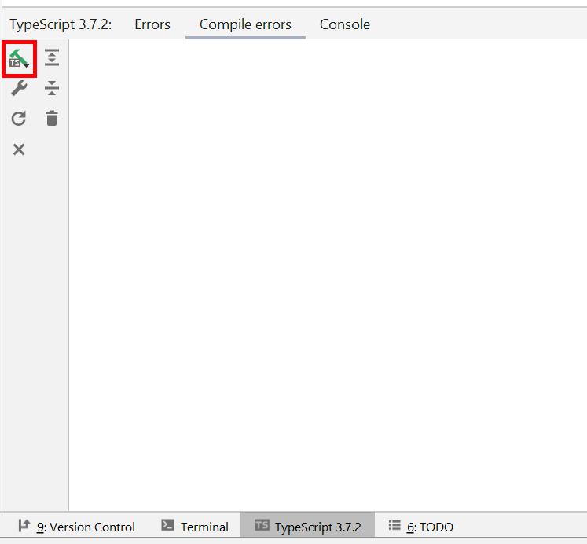
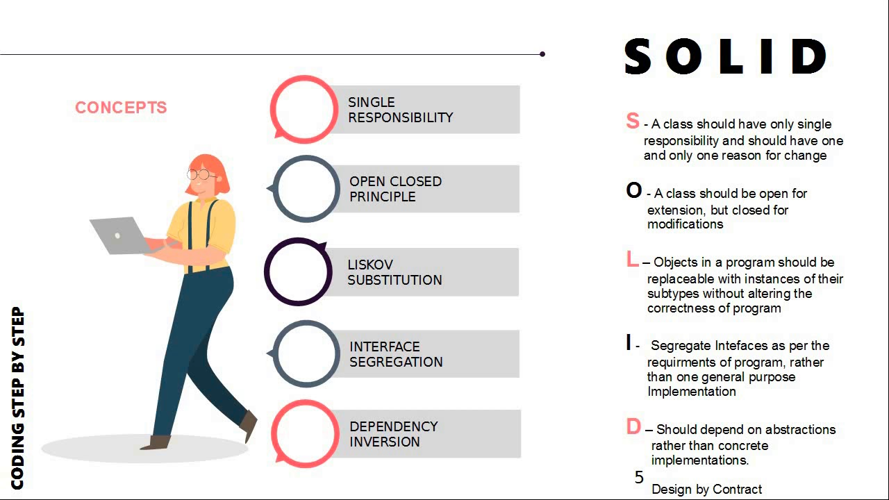

# typescript-solid

---
## MaTS


---
## Introduction

Javascript is a great language, but it does not come **Type Safety** out of the box. This is the ability for the programmer to define input and output variables for a function (like in PHP) and so having more stability in their code.
This is why we are going to explore a new language called TypeScript, which builds on JavaScript, which adds static type definitions.

For example, trying to pass a String to function that expects a number will throw an error on compilation, even before testing it in the browser! This way you get very fast feedback in your editor when there are problems in your code.
In code this looks like this:

```javascript
function sum(a, b) {
    return a+b;
}
```

becomes

```typescript
function sum(a : number, b : number) : number {
    return a+b;
}
```

Trying to pass a string to this function will now immediately trigger an error in your console.

Start by reading [TypeScript for JavaScript Programmers](https://www.typescriptlang.org/docs/handbook/typescript-in-5-minutes.html).

---
## Chapter 1: TypeScript

### Introduction to TypeScript

*TypeScript is a super set of JavaScript.*

TypeScript is Typed JavaScript.  
TypeScript adds types to JavaScript to help you speed up the development by catching errors before you even run the JavaScript code.

TypeScript builds on top of JavaScript. First, you write the TypeScript code. Then, you compile the TypeScript code into plain JavaScript code using a TypeScript compiler.

Once you have the plain JavaScript code, you can deploy it to any environments that JavaScript runs.

TypeScript files use the .ts extension rather than the .js extension of JavaScript files.



TypeScript uses the JavaScript syntax's and adds additional syntax's for supporting Types.

If you have a JavaScript program that does not have any syntax errors, it is also a TypeScript program. It means that all JavaScript programs are TypeScript programs. This is very helpful if you’re migrating an existing JavaScript codebase to TypeScript.

The following diagram shows the relationship between TypeScript and JavaScript:



#### Summary 

1. TypeScript adds additional syntax to JavaScript to support a **tighter integration with your editor.** Catch errors early in your editor.
2. TypeScript code converts to JavaScript, which **runs anywhere JavaScript runs:** In a browser, on Node.js ...
3. **TypeScript understands JavaScript** and uses **type inference to give you great tooling** without additional code.

*Remember, the power of something like TypeScript is not what it allows us to do, but what it forbids us from doing!*

### Why TypeScript?

#### TypeScript improves productivity while helping to avoid bugs

Types increase productivity by helping you avoid many mistakes. By using types, you can catch bugs at the compile-time instead of having them occurring at runtime.

The following function adds two numbers ````x```` and ````y````:

````javascript
function add(x, y) {
   return x + y;
}
````
If you get the values from HTML input elements and pass them into the function, you may get an unexpected result:

````javascript
let result = add(input1.value, input2.value);
console.log(result); // result of concatenating strings
````

For example, if users entered ````10```` and ````20````, the ````add()```` function would return ````1020````, instead of ````30````.

The reason is that the ````input1.value```` and ````input2.value```` are strings, not numbers. When you use the operator ````+```` to add two strings, it concatenates them into a single string.

When you use TypeScript to explicitly specify the type for the parameters like this:

````javascript
function add(x: number, y: number) {
   return x + y;
}
````

In this function, we added the number types to the parameters. The function ````add()```` will accept only numbers, not any other values.

When you invoke the function as follows:

````javascript
let result = add(input1.value, input2.value);
````

… the TypeScript compiler will issue an error if you compile the TypeScript code into JavaScript. Hence, you can prevent the error from happening at runtime.

---
## Chapter 2: The installation (Mac OS - Apple Silicon)

### For HomeBrew

#### TypeScript

1. go to HomeBrew:

- https://brew.sh/

2. Search for 'TypeScript'

3. Check if TypeScript is compatible with your current node version



4. To check your Node version (you should have it installed by now), go to your terminal and type:
````
node -v
````

If your current version of node is compatible with TypeScript skip to step 12, otherwise continue with the next step

5. Check if your system is up-to-date by running the following command

````
brew upgrade
````

6. To update your Node version, go back to HomeBrew
7. Search for 'Node' and run the command or just copy pasta the next command
````
brew install node
````
7. Check what version you are running now, with:

````
node -v
````

It should still show you the original version you were running, to fix this go to the next step, otherwise skip to step 12

8. Open your zshrc with the following command:
````
nano open /User/yourUserNameHere/.zshrc
````
you should have the path to your current Node version here

9. you can delete the path, but I recommend **commenting it out** (this way, if you need the stable version or a previous version for a project, you can simply uncomment it)

10. Check if your system is in order
````
brew doctor 
````

11. Now you should have your compatible Node version
````
node -v
````

12. To install TypeScript run:
````
brew install typescript
````

13. Now you have TypeScript! Type the following command :)
````
tsc
````

#### PhpStorm integration

There are 2 ways of working with TypesScript in your IDE, the first option is to make it so all TypeScript files are compiled the moment you change something in the file.
To do this go to ```File | Settings | Languages & Frameworks | TypeScript```. Make sure to check the correct checkbox.



Another option is to click on the "compile" button at the bottom of your editor. You can then either recompile the file you are currently in, or all files in the entire project.  



### Parcel

#### Via NPM

1. Run the following command in your terminal
````
npm install -g parcel-bundler
````

2. There could be some vulnerabilities, if so run:
````
npm audit fix
````

3. To check if all vulnerabilities are dealt with run
````
npm auit
````

The audit command submits a description of the dependencies configured in your project to your default registry and asks for a report of known vulnerabilities.

#### What is Parcel

Parcel is a web application bundler, that will compile all the JS code, parcel supports TypeScript out of the box without any additional configuration.

Parcel automatically transpiles TypeScript whenever you use a ````.ts```` or ````.tsx```` file.  
In addition to stripping the types to convert TypeScript to JavaScript, Parcel also compiles modern language features like classes and async await as necessary, according to your browser targets. It also transpiles JSX automatically.

---

## Chapter 3: SOLID Principles



SOLID is a set of 5 principles that helps you write good OOP code, and is considered one of the leading theories for modern code.

1. Single responsibility
2. Open closed principle
3. Liskov substitution
4. Interface segregation
5. Dependency inversion

SOLID

The 5 principles all serve the same purpose:

*To create understandable, readable, and testable code that many developers can collaboratively work on.*

In the directory 'SOLID' you will find each principle, how they work and are applied.  

---
## Sources
- Chapter 1:
  - https://www.typescripttutorial.net/typescript-tutorial/what-is-typescript/
  - https://www.typescriptlang.org/
- Chapter 2:
  - HomeBrew: https://brew.sh/
  - TypeScript: https://formulae.brew.sh/formula/typescript#default
  - Parcel: 
    - https://parceljs.org/docs/
    - https://parceljs.org/languages/typescript/#babel
    - https://github.com/parcel-bundler/parcel
- Chapter 3: https://www.npmjs.com/package/parcel-bundler
  - https://www.freecodecamp.org/news/solid-principles-explained-in-plain-english/