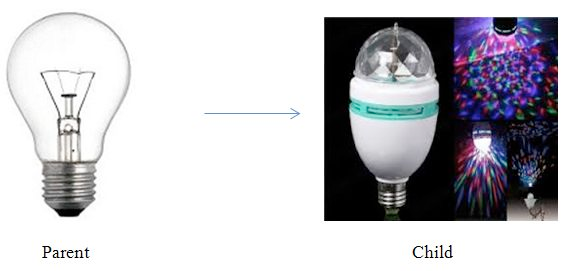
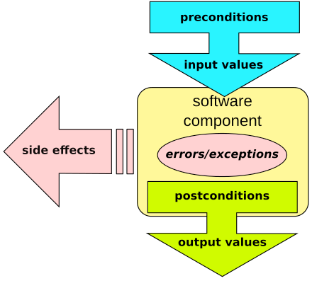

# Liskov substitution principle (soLid)

## MaTS


---
## Chapter 1: What is the Liskov substitution principle?

Simply put, the Liskov Substitution Principle (LSP) states that objects of a superclass should be replaceable with objects of its subclasses without breaking the application.

In other words, what we want is to have the objects of our subclasses behaving the same way as the objects of our superclass. 

It extends the Open/Closed Principle by focusing on the behavior of a superclass and its subtypes.

Remember in 5th grade when your maths teacher taught you the formula of squares for rectangles and squares?  
I always remembered square as the more “formula-friendly” rectangle. It is after all a rectangle with equal sides, isn’t it?

Now suppose you have a base class Rectangle and I tell you to create a new class Square and maximize reuse.  
Will you inherit the Rectangle class inside the Square class?

No matter how tempting it might sound or how well you intend to handle it, this small “reuse” will be totally **WRONG!**

### For example
````typescript
class Rectangle {
    public void setWidth(int width) {
        this.width= width;
}
public void setHeight(int height){
        this.height= height;
}
public void area(){
        return height * width;
}
...
}
````
````typescript
class Square extends Rectangle {
    public void setWidth(int width){
        super.setWidth(width);
        super.setHeight(width);
}
    public void setHeight(int height){
        super.setWidth(height);
        super.setHeight(height)
}
}
````

By looking at the above scenario you might still argue that it looks pretty consistent.  
That is true for the language you are coding in and also for Mathematics but a Square might not always satisfy the behavior of a Rectangle.

**For example**

````typescript
void clientMethod(Rectangle rec){
    rec.setWidth(5);
    rec.setHeight(4);
    assert (rec.area() === 20);
}
````

The ````ClientMethod()```` expects a Rectangle and asserts a value of the area.  
All was well up to this point but now when we do ````rec.setHeight(4)````, the Square will set both its sides as 4, and that will totally mess up the assert statement.

We were expecting a Rectangle of sides 5 and 4 to have an area of 20, but we got a Square with sides 4 and 4 and area 16.

**Hence, using Square’s object in place of the Rectangle’s object totally breaks LSP!**


---

## Chapter 2: Some real-life examples

There is still some confusion around Liskov substitution principle for me, so here are some real-life examples for clarification.

1. Your landlord wanted you to fix the main gate’s light bulb but you gave him Diwali vibes instead! (He won’t be happy!)



2. You fed your neighbor’s pet duck expired Bread and now it’s dead. You decided to replace it with a toy duck. (He won’t be happy!)


### Chapter 3: More practical implementation

The principle defines that objects of a superclass shall be replaceable with objects of its subclasses without breaking the application.  
That requires the objects of your subclasses to behave in the same way as the objects of your superclass. You can achieve that by following a few rules, which are pretty similar to the [design by contract](https://en.wikipedia.org/wiki/Design_by_contract).


### Chapter 3.1: Design by contract

  
A design by contract scheme

### Chapter 3.2: Enforcing LSP

If you decide to apply this principle to your code, the behavior of your classes becomes more important than its structure. Unfortunately, there is no easy way to enforce this principle.  

You need to implement your own checks to ensure that your code follows the Liskov Substitution Principle. In the best case, you do this via code reviews and test cases. In your test cases, you can execute a specific part of your application with objects of all subclasses to make sure that none of them causes an error or significantly changes its performance. You can try to do similar checks during a code review. But what’s even more important is that you check that you created and executed all the required test cases.

## Chapter 4: Implementation

### Chapter 4.1: The mission

Look at the old.ts file and open the index.html file, refactor the Discount class in 3 different classes with the same interface "VariableDiscount" & "FixedDiscount" & "NoDiscount"

#### Discuss
Do you understand what the use is of having the class NoDiscount? This prevents us from having to write extra if-statements inside product to check if we actually have a Discount dependency. It might look strange but these null or void classes are very common in a lot of popular libraries!

#### Chapter 4.2: Polymorphism
You might already be aware of Polymorphism, but just to remind you, here is the short summary:  
If 2 different classes use **the same interface**, so they have the same function names: the code that uses this class does not care about which one class it receives.  
In short: When two objects have the same interface, they are functionally interchangeable = polymorphism.

### Chapter 4.3: Show me the code

#### Chapter 4.3.1: The original code (bad)

1. 
````typescript
//This is called a Union, the discountType can only contain the following 3 values:
type discountType = "variable" | "fixed" | "none";
````
2. class Discount
````typescript
class Discount {
    private _type: discountType;
    private _value: number;

    constructor(type : discountType, value : number = 0) {
        this._type = type;
        this._value = value;

        if(this._type != 'none' && value <= 0) {
            throw new Error('You cannot create a '+ this._type + ' discount with a negative value');
        }
    }

    apply(price : number) : number {
        //@todo: instead of using magic values as string in this, it would be a lot better to change them into constant. This would protect us from misspellings. Can you improve this?
        if(this._type === "none")  {
            return price;
        }
        else if(this._type === "variable")  {
            return (price - (price * this._value / 100));
        } else if(this._type === "fixed") {
            return Math.max(0, price - this._value);
        }
        else {
            throw new Error('Invalid type of discount');
        }
    }

    showCalculation(price : number) : string {
        if(this._type === "none")  {
            return "No discount";
        }
        else if(this._type === "variable")  {
            return price + " € -  "+ this._value +"%";
        } else if(this._type === "fixed") {
            return price + "€ -  "+ this._value +"€ (min 0 €)";
        }
        else {
            throw new Error('Invalid type of discount');
        }
    }
}

````
3. class Product
````typescript
class Product {
    private _name : string;
    private _price : number;
    private _discount : Discount;

    constructor(name: string, price: number, discount: Discount) {
        this._name = name;
        this._price = price;
        this._discount = discount;
    }

    get name(): string {
        return this._name;
    }

    get discount(): Discount {
        return this._discount;
    }

    get originalPrice(): number {
        return this._price;
    }

    //The reason we call this function "calculateX" instead of using a getter on Price is because names communicate a lot of meaning between programmers.
    //most programmers would assume a getPrice() would be a simple display of a property that is already calculated, but in fact this function does a (more expensive) operation to calculate on the fly.
    calculatePrice() : number {
        return this._discount.apply(this._price);
    }

    showCalculation() : string {
        return this._discount.showCalculation(this._price);
    }
}
````
4. class shoppingBasket
````typescript
class shoppingBasket {
    //this array only accepts Product objects, nothing else
    private _products: Product[] = [];

    get products(): Product[] {
        return this._products;
    }

    addProduct(product: Product) {
        this._products.push(product);
    }
}
````
5. Creating products + showing on page
````typescript
let cart = new shoppingBasket();
cart.addProduct(new Product('Chair', 25, new Discount("fixed", 10)));
//cart.addProduct(new Product('Chair', 25, new Discount("fixed", -10)));
cart.addProduct(new Product('Table', 50, new Discount("variable", 25)));
cart.addProduct(new Product('Bed', 100, new Discount("none")));

const tableElement = document.querySelector('#cart tbody');
cart.products.forEach((product) => {
    let tr = document.createElement('tr');

    let td = document.createElement('td');
    td.innerText = product.name;
    tr.appendChild(td);

    td = document.createElement('td');
    td.innerText = product.originalPrice.toFixed(2) + " €";
    tr.appendChild(td);

    td = document.createElement('td');
    td.innerText = product.calculatePrice().toFixed(2) + " €";
    tr.appendChild(td);

    td = document.createElement('td');
    td.innerText = product.showCalculation();
    tr.appendChild(td);

    tableElement.appendChild(tr);
});
````

#### Chapter 4.3.2: The improved code

1. Interface
````typescript
interface Discount {
    apply(price: number) : number;
    showCalculation(price: number) : string;
}
````
add text here
2. class Variable  
Here I am making a class for each possible value of ````discount````
````typescript
class Variable implements Discount{
    private _value: number;

    constructor(value: number) {
        this._value = value;
    }

    apply(price: number): number {
        return price - (price * this._value / 100);
    }

    showCalculation(price: number): string {
        return price + " € -  " + this._value + "%";
    }
}
````
3. class Fixed
````typescript
class Fixed implements Discount{
    private _value: number;

    constructor(value: number) {
        this._value = value;
    }

    apply(price: number): number {
        return Math.max(0, price - this._value);
    }

    showCalculation(price: number): string {
        return price + "€ -  " + this._value + "€ (min 0 €)";
    }
}
````
4. class NoDiscount
````typescript
class NoDiscount implements Discount{
  apply(price: number): number {
    return price;
  }
  showCalculation(price: number): string {
    return "No discount";
  }
}
````
you might have noticed all classes ````implement```` the ````interface```` 
add text here
5. class Product
````typescript
class Product {
    private _name: string;
    private _price: number;
    private _discount: Variable | Fixed | NoDiscount;

    constructor(name: string, price: number, discount: Variable | Fixed | NoDiscount) {
        this._name = name;
        this._price = price;
        this._discount = discount;
    }

    get name(): string {
        return this._name;
    }

    get discount(): Variable | Fixed | NoDiscount {
        return this._discount;
    }

    get originalPrice(): number {
        return this._price;
    }

    //The reason we call this function "calculateX" instead of using a getter on Price is because names communicate a lot of meaning between programmers.
    //most programmers would assume a getPrice() would be a simple display of a property that is already calculated, but in fact this function does a (more expensive) operation to calculate on the fly.
    calculatePrice(): number {
        return this._discount.apply(this._price);
    }

    showCalculation(): string {
        return this._discount.showCalculation(this._price);
    }
}
````
add text here 
6. creating products + showing on page
````typescript
let cart = new shoppingBasket();
cart.addProduct(new Product('Chair', 25, new Fixed(10)));
//cart.addProduct(new Product('Chair', 25, new Discount("fixed", -10)));
cart.addProduct(new Product('Table', 50, new Variable(25)));
cart.addProduct(new Product('Bed', 100, new NoDiscount()));

const tableElement = <HTMLTableElement>document.querySelector('#cart tbody');
cart.products.forEach((product) => {
  let tr = document.createElement('tr');

  let td = document.createElement('td');
  td.innerText = product.name;
  tr.appendChild(td);

  td = document.createElement('td');
  td.innerText = product.originalPrice.toFixed(2) + " €";
  tr.appendChild(td);

  td = document.createElement('td');
  td.innerText = product.calculatePrice().toFixed(2) + " €";
  tr.appendChild(td);

  td = document.createElement('td');
  td.innerText = product.showCalculation();
  tr.appendChild(td);

  tableElement.appendChild(tr);
});
````
add text here

---
## Chapter 5: Summary

The Liskov Substitution Principle extends the Open/Closed principle and enables you to replace objects of a parent class with objects of a subclass without breaking the application. This requires all subclasses to behave in the same way as the parent class. To achieve that, your subclasses need to follow these rules:

1. Don’t implement any stricter validation rules on input parameters than implemented by the parent class.
2. Apply at the least the same rules to all output parameters as applied by the parent class.


## Sources
- Chapter 1:
  - https://blog.knoldus.com/what-is-liskov-substitution-principle-lsp-with-real-world-examples/
  - https://stackify.com/solid-design-liskov-substitution-principle/
- Chapter 2:
  -  https://blog.knoldus.com/what-is-liskov-substitution-principle-lsp-with-real-world-examples/
- Chapter 3: 
  - https://stackify.com/solid-design-liskov-substitution-principle/
  - https://en.wikipedia.org/wiki/Design_by_contract
- Chapter 5: 
  - https://stackify.com/solid-design-liskov-substitution-principle/