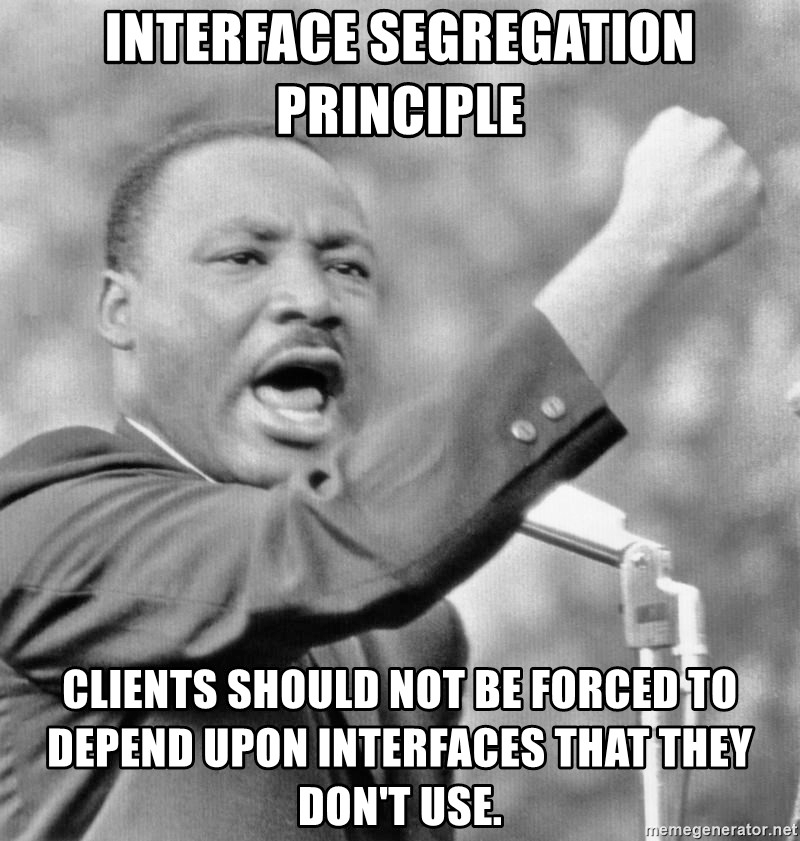

# Interface segregation principle (solId)

## MaTS



---

## Chapter 1: What is the Interface segregation principle?

### *“Clients should not be forced to depend upon interfaces that they do not use.”*

Sounds obvious, doesn’t it? Well, it’s pretty easy to violate this interface, especially if your software evolves, and you have to add more and more features. But more about that later.

Similar to the Single Responsibility Principle, the goal of the Interface Segregation Principle is to reduce the side effects and frequency of required changes by splitting the software into multiple, independent parts.

As I will show you in the following example, this is only achievable if you define your interfaces so that they fit a specific client or task.

### Chapter 1.1 Violating ISP


"Many client-specific interfaces are better than one general-purpose interface."

Interfaces are really good, but like with everything that is good you can go overboard. It is really important that when we create interfaces that are precise and modular. 
Almost all languages support adding multiple interfaces to the same class, this in contrast to extending a class, where only a few languages (eg. c++) allow multiple inheritance.
This allows us to create a lot of small, granular interfaces that then allows us to reuse interfaces to multiple different classes.

As a rule of thumb, her is an easy rule: **If at any point you are writing 'this function is not supported' in a class to adhere to an interface, your interface is to big.**

The problem of these big interfaces is sometimes called a **Fat Interface*. A fat interface violates Single Responsibility Principle too as it’s handling more than one responsibilities at a time.

Let us think of an example, for example, let us think back of an animal example, look at the following code:

```typescript
interface BirdInterface {
    laysEgg();
    makeSound();
    fly();
    getFlySpeed();
}
class Parrot implements BirdInterface {}
```

This works great, but what happens when we want to make a penguin? Those cute creatures cannot fly! So let us move the *fly()* to a separate interface:

```typescript
interface BirdInterface {
    laysEgg();
    makeSound();
}
interface CanFly {
    fly();
    getFlySpeed();
}
```

### Exercise: step 1
Go into [old.ts](old.ts) and look at the 2 different users. They have a couple of authentication methods but like you can see, Admin users can only login with a password, not with facebook or google because of security reasons.
Refactor the current fat interface so each auth method has each own interface.
As an extra difficulty, there is a feature request for a google bot to be able to login on the site, he can only use the google option to log in. Can you make this extra class?

### Exercise: Step 2 (Optional)
You might notice that both the Google and Facebook code is almost identical, could you maybe refactor this code to small, separate dependencies?

## Sources

- Chapter 1:
  - https://stackify.com/interface-segregation-principle/
  - 