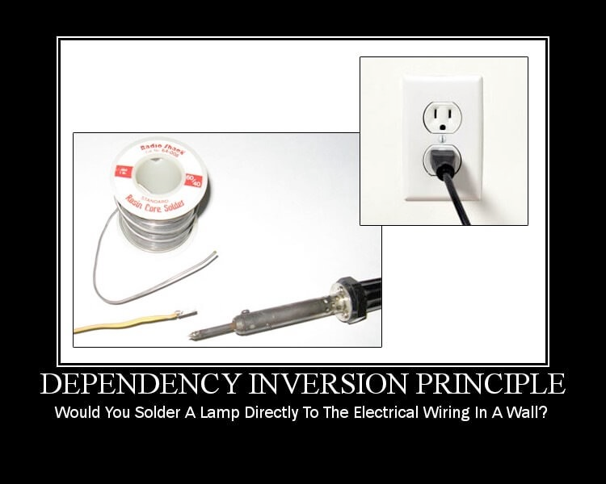

# Dependency inversion principle (soliD)

## MaTS

---
## Chapter 1: What is the Dependency inversion principle?

**It is based on the Open/Closed Principle and the Liskov Substitution Principle.**

The general idea of this principle is as simple as it is important: **High-level modules, which provide complex logic, should be easily reusable and unaffected by changes in low-level modules, which provide utility features**.  
To achieve that, you need to introduce an **abstraction that decouples the high-level and low-level modules** from each other.

1. High-level modules should not depend on low-level modules. Both should depend on abstractions.
2. Abstractions should not depend on details. Details should depend on abstractions.

An important detail of this definition is, that high-level and low-level modules depend on the abstraction.  
The design principle does not just change the direction of the dependency, as you might have expected when you read its name for the first time.  
It splits the dependency between the high-level and low-level modules by introducing an abstraction between them.  
So in the end, you get two dependencies:

1. the high-level module depends on the abstraction, and
2. the low-level depends on the same abstraction.

At its heart, the DIP is about structure. The manner in which you structure your program entities, and the way in which they interact with one another, has a direct impact on your ability to conform to the rest of the SOLID principles (the benefits of which we have discussed previously.) If your dependencies are mismanaged, then the likelihood of your code being flexible, maintainable, and reusable is drastically diminished.

## Story time

The Restaurant class depends on usage of its Oven object. What if we wanted to make a restaurant that uses a different kind of cooking instrument? As currently implemented, we couldn’t do so without going into the Restaurant class and making changes, which would violate the Open/Closed Principle.
    Changes to the Oven object have the potential to cascade through the program and break the Restaurant class’ Cook method. For example, what if we decided that we wanted to make our ovens electric rather than gas and changed the LightGas and ExtinguishGas method names? Doing so would effectively break Restaurant because it relies on using those Oven methods as currently named.
    The coupling between Restaurant and Oven reduces portability, meaning that we can’t re-use Restaurant in another location without bringing Oven with it. (Even if the other program never uses Oven.)

---
## Sources:

- https://dev.to/tamerlang/understanding-solid-principles-dependency-inversion-1b0f
- https://stackify.com/dependency-inversion-principle/

